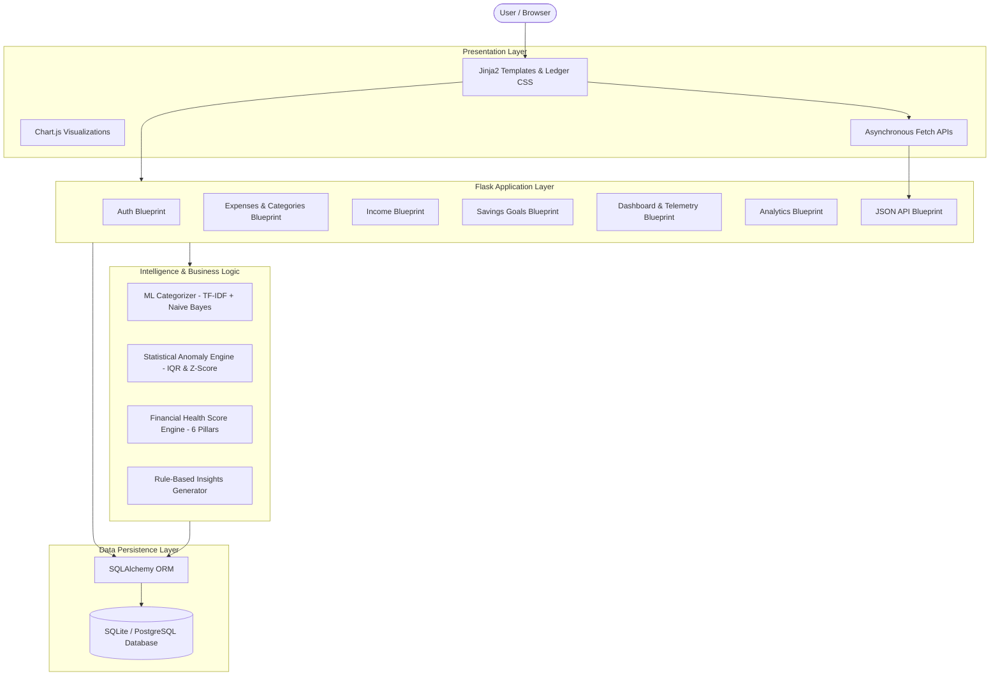
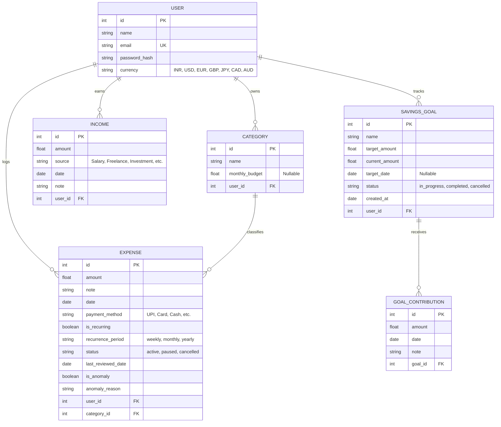

# SpendWise — Comprehensive Project Documentation & Technical Reference

> **SpendWise** is an intelligent personal finance management and subscription telemetry web application built with **Python**, **Flask**, **SQLAlchemy**, and **scikit-learn**, styled with a distinctive paper-and-ink ledger design language.

---

## 📑 Table of Contents

1. [Executive Summary & Product Vision](#1-executive-summary--product-vision)
2. [System Architecture & Data Flow](#2-system-architecture--data-flow)
3. [Database Schema & Data Models](#3-database-schema--data-models)
4. [Feature Catalog & Technical Specifications](#4-feature-catalog--technical-specifications)
   - [4.1 Intelligent Financial Dashboard](#41-intelligent-financial-dashboard)
   - [4.2 ML-Based Expense Categorization](#42-ml-based-expense-categorization)
   - [4.3 Statistical Spending Anomaly Detection](#43-statistical-spending-anomaly-detection)
   - [4.4 Savings Goals & Monthly Target Pacing](#44-savings-goals--monthly-target-pacing)
   - [4.5 Income Management & Cashflow Tracking](#45-income-management--cashflow-tracking)
   - [4.6 Proactive Subscription Audit & Control](#46-proactive-subscription-audit--control)
   - [4.7 Transparent Financial Health Score (0–100)](#47-transparent-financial-health-score-0100)
   - [4.8 Two-Step CSV Import & Multi-Format Export](#48-two-step-csv-import--multi-format-export)
   - [4.9 Interactive Analytics & Visualizations](#49-interactive-analytics--visualizations)
   - [4.10 Multi-Currency & User Preferences](#410-multi-currency--user-preferences)
5. [Route & API Endpoint Catalog](#5-route--api-endpoint-catalog)
6. [Security & Error Handling Architecture](#6-security--error-handling-architecture)
7. [Frontend & Ledger Design System](#7-frontend--ledger-design-system)
8. [Automated Test Suite (40 Tests)](#8-automated-test-suite-40-tests)
9. [Installation, Setup & Deployment](#9-installation-setup--deployment)

---

## 1. Executive Summary & Product Vision

Traditional expense trackers act as passive transaction loggers. SpendWise transforms personal bookkeeping into an **active financial co-pilot** through:
* **Machine Learning**: Eliminates manual category tagging by classifying transaction descriptions automatically in real-time.
* **Statistical Anomaly Detection**: Proactively detects accidental double-charges or unusual spending spikes using category-specific IQR and Z-score distributions.
* **Behavioral Nudges**: Surfaces forgotten subscriptions unreviewed in 60+ days to stop recurring budget drain.
* **Transparent Diagnostics**: Provides an explainable 0–100 Financial Health Score with itemized recommendations.

---

## 2. System Architecture & Data Flow

SpendWise follows a clean, modular Model-View-Controller (MVC) architecture with dedicated intelligence layers for ML classification, statistical analysis, and diagnostic scoring:



---

## 3. Database Schema & Data Models

The relational schema is designed for strict user isolation and automatic database migration:



---

## 4. Feature Catalog & Technical Specifications

### 4.1 Intelligent Financial Dashboard
* **Cashflow KPIs**: Real-time aggregation of **Total Monthly Income**, **Total Spent**, **Net Savings / Cashflow** ($Income - Expense$), **Savings Rate** ($\frac{Income - Expense}{Income} \times 100$), **Remaining Budget**, and **Monthly Subscriptions**.
* **Month-over-Month Delta**: Calculates spending change against the previous calendar month with directional indicator pills ($+12\%$ or $-8\%$).
* **Dynamic Insights Section**: Surfaces explainable, data-driven observations from real user data (e.g. *"Food & Dining spending increased by 23% vs last month"*, *"Projected to exceed budget by ₹2,400"*).
* **Recent Ledger Slip**: Table of recent transactions with payment methods, anomaly chips, 1-click duplication to today's date, and a receipt popup modal.

---

### 4.2 ML-Based Expense Categorization
* **Model Engine (`app/ml.py`)**:
  * Feature Extraction: Scikit-learn `TfidfVectorizer` (unigrams + bigrams, lowercase, stopword filtering).
  * Classifier: `MultinomialNB` calibrated with smoothing parameter $\alpha = 0.05$.
  * Seed Corpus: 100+ comprehensive merchant patterns (*Swiggy, Zomato, Starbucks, McDonald's, Uber, Ola, Shell petrol, Netflix, Spotify, AWS, Electricity bill, Apollo Pharmacy, Zara, Nike, etc.*).
* **Real-Time Asynchronous Prediction**: As the user types in the transaction note, debounced AJAX calls `/api/predict-category`. If confidence is $\ge 40\%$, the UI displays a badge (`⚡ ML Prediction: Food & Dining (94% confidence)`) and automatically selects the category dropdown.
* **Manual Override**: The user can choose any other category at any time; manual selections take absolute priority.

---

### 4.3 Statistical Spending Anomaly Detection
* **Mathematical Formula (`app/anomaly.py`)**:
  * Evaluates category-specific historical expenses:
    $$\text{IQR} = Q_{75} - Q_{25}$$
    $$\text{Upper Threshold} = \max\left(Q_{75} + 1.5 \times \text{IQR},\; \mu + 2.2 \times \sigma,\; 2.2 \times \text{Median}\right)$$
  * **Noise Floor Filtering**: Requires amount $\ge 300.0$ (or currency equivalent) and $\ge 3$ prior category records to prevent false positives on pocket-money amounts.
* **Alert System**: Automatically flags anomalies with specific reasons (e.g. *"This transaction of ₹4,800 is 4.8x higher than your typical ₹150–₹450 range in Food & Dining"*).

---

### 4.4 Savings Goals & Monthly Target Pacing
* **Savings Target Calculator (`app/routes/goals.py`)**:
  * Calculates the exact monthly savings required to hit a goal:
    $$\text{Months Left} = (TargetYear - CurrentYear) \times 12 + (TargetMonth - CurrentMonth)$$
    $$\text{Required Monthly Savings} = \frac{TargetAmount - CurrentAmount}{\max(1, \text{Months Left})}$$
* **Interactive Milestones**: Visual progress bar, direct deposit logging (`+ Add Money`), overdue goal detection ($TargetDate < Today$ while incomplete), and automatic completion celebration when fully funded.

---

### 4.5 Income Management & Cashflow Tracking
* **Income Streams (`app/routes/income.py`)**:
  * Record earnings with source categorization: *Salary, Freelance, Business, Investment, Bonus, Gift, Rental, Other*.
  * Month/year navigation with tabular ledger display.
  * Direct synchronization with net savings and savings rate calculations across dashboard and analytics.

---

### 4.6 Proactive Subscription Audit & Control
* **60-Day Stale Audit**: Scans active recurring commitments and flags services unreviewed for $>60$ days to prevent "forgotten plan" syndrome.
* **30-Day Lookahead Timeline**: Forecasts upcoming renewal dates with urgent warning tags for bills due within 7 days.
* **1-Click Renewal Logger**: `+ Log Renewal` button instantly generates the actual expense transaction for the current cycle and updates the review timestamp.
* **Lifecycle Statuses**: Mark subscriptions as **Active**, **Paused**, or **Cancelled** without deleting historical records.

---

### 4.7 Transparent Financial Health Score (0–100)
Calculated deterministically across 6 core pillars in `app/health_score.py`:

| Pillar | Max Points | Evaluation Metric |
|---|:---:|---|
| **Budget Adherence** | 25 | Ratio of categories where spending $\le$ monthly budget limit |
| **Savings Rate** | 20 | $\ge 30\%$ savings rate = 20 pts; 20–29% = 17 pts; 10–19% = 13 pts; $<0\%$ = 3 pts |
| **Cashflow Margin** | 20 | Income $\ge 1.3\times$ Expenses = 20 pts; Income $\ge$ Expenses = 14 pts |
| **Subscription Burden**| 15 | Monthly recurring cost $\le 12\%$ of expenses = 15 pts; $>32\%$ = 4 pts |
| **Spend Stability** | 10 | 0 anomalies = 10 pts; 1 anomaly = 6 pts; 2+ anomalies = 3 pts |
| **Goals Momentum** | 10 | Active, on-track, or completed goals = 8–10 pts; Overdue = 4 pts |

* **Grade Tiers**: **Excellent** ($85-100$), **Good** ($70-84$), **Fair** ($50-69$), **Needs Attention** ($<50$).
* **Itemized Feedback**: Outputs specific bullet points explaining exact strengths and actionable recommendations.

---

### 4.8 Two-Step CSV Import & Multi-Format Export
* **2-Step Validation Preview (`/expenses/import/preview`)**:
  * **Step 1 (Parse & Inspect)**: Inspects uploaded CSV across multiple date formats (`YYYY-MM-DD`, `DD/MM/YYYY`, `MM/DD/YYYY`).
  * **Step 2 (Diagnostic Summary)**: Renders a preview screen showing total detected rows, valid rows, duplicate warnings (matching existing date, amount, note, and category), and invalid rows (negative/bad amounts).
  * **Step 3 (Confirmed Commit)**: Imports only approved valid rows into the database with auto-creation of missing categories.
* **Multi-Format Export**: Download full or filtered ledger records as **CSV** or structured **JSON**.

---

### 4.9 Interactive Analytics & Visualizations
* **Chart.js Analytics View (`/analytics`)**:
  1. *6-Month Income vs. Expenses* (Dual grouped bar chart).
  2. *Net Savings Cashflow Trend* (Area line chart).
  3. *Category Spending Share* (Doughnut chart with interactive tooltips).
  4. *Budget vs. Actual Variance* (Comparison bar chart).
  5. *Financial Health Score Diagnostic Grid* (Component breakdown & pillar diagnostics).

---

### 4.10 Multi-Currency & User Preferences
* Instant switching between **INR (₹)**, **USD ($)**, **EUR (€)**, **GBP (£)**, **JPY (¥)**, **CAD (CA$)**, and **AUD (A$)**.
* Dynamically updates symbols across all figures, charts, modals, and exported CSVs.

---

## 5. Route & API Endpoint Catalog

| Endpoint URL | HTTP Method | Blueprint | Description | Auth Required |
|---|:---:|---|---|:---:|
| `/` | `GET` | `dashboard` | Main dashboard with KPIs, health banner, recent ledger | Yes |
| `/login` | `GET, POST` | `auth` | User login form & authentication handler | No |
| `/signup` | `GET, POST` | `auth` | User registration & starter category seeding | No |
| `/logout` | `GET` | `auth` | Clears user session | Yes |
| `/expenses` | `GET` | `expenses` | Full expenses ledger with search & filters | Yes |
| `/expenses/add` | `POST` | `expenses` | Record expense (with anomaly check & payment method) | Yes |
| `/expenses/<id>/edit` | `POST` | `expenses` | Edit expense amount, category, date, payment method | Yes |
| `/expenses/<id>/duplicate` | `POST` | `expenses` | Clones an expense entry to today's date | Yes |
| `/expenses/<id>/delete` | `POST` | `expenses` | Delete expense entry | Yes |
| `/expenses/import/preview`| `POST` | `expenses` | Step 1 of CSV upload: validate, check duplicates, preview | Yes |
| `/expenses/import/confirm`| `POST` | `expenses` | Step 2 of CSV upload: commit verified rows to database | Yes |
| `/expenses/import` | `POST` | `expenses` | Direct CSV import fallback | Yes |
| `/expenses/sample-csv` | `GET` | `expenses` | Download sample CSV template | Yes |
| `/categories/add` | `POST` | `expenses` | Create category (budget is optional) | Yes |
| `/categories/<id>/edit` | `POST` | `expenses` | Edit category name and monthly budget | Yes |
| `/categories/<id>/delete` | `POST` | `expenses` | Delete category and cascade expenses | Yes |
| `/income` | `GET` | `income` | Income ledger and monthly summary | Yes |
| `/income/add` | `POST` | `income` | Record income entry | Yes |
| `/income/<id>/edit` | `POST` | `income` | Edit income amount, source, date | Yes |
| `/income/<id>/delete` | `POST` | `income` | Delete income record | Yes |
| `/goals` | `GET` | `goals` | Savings goals dashboard and monthly recommendations | Yes |
| `/goals/add` | `POST` | `goals` | Create savings goal | Yes |
| `/goals/<id>/contribute` | `POST` | `goals` | Log direct deposit toward goal | Yes |
| `/goals/<id>/edit` | `POST` | `goals` | Edit savings goal target, date, status | Yes |
| `/goals/<id>/delete` | `POST` | `goals` | Delete savings goal and contributions | Yes |
| `/subscriptions` | `GET` | `dashboard` | Subscription audit, 60-day review, renewal schedule | Yes |
| `/subscriptions/<id>/renew`| `POST` | `dashboard` | 1-click renewal logger | Yes |
| `/expenses/<id>/toggle-status`| `POST` | `expenses` | Switch subscription status (active/paused/cancelled) | Yes |
| `/expenses/<id>/mark-reviewed`| `POST` | `expenses` | Confirms active subscription for next 60 days | Yes |
| `/analytics` | `GET` | `analytics` | Interactive Chart.js analytics & diagnostics | Yes |
| `/export/csv` | `GET` | `dashboard` | Export ledger as `.csv` or `.json` | Yes |
| `/settings/preferences` | `POST` | `dashboard` | Update display currency and user profile name | Yes |
| `/api/predict-category` | `POST` | `api` | Async JSON endpoint for ML category prediction | Yes |
| `/api/check-anomaly` | `POST` | `api` | Async JSON endpoint for spending anomaly check | Yes |

---

## 6. Security & Error Handling Architecture

* **CSRF Protection**: All form submissions (POST/PUT/DELETE) require valid CSRF tokens via `Flask-WTF`.
* **User Data Isolation**: Every database query explicitly filters by `user_id == current_user.id`.
* **Password Hashing**: Uses `werkzeug.security` with salted `scikit-pbkdf2:sha256` hashes.
* **Custom Error Handlers**:
  * `400 Bad Request` (`app/templates/errors/400.html`)
  * `403 Forbidden` (`app/templates/errors/403.html`)
  * `404 Not Found` (`app/templates/errors/404.html`)
  * `500 Internal Error` (`app/templates/errors/500.html`)
* **Automatic Database Migration**: Non-destructive startup schema auto-migration checks existing SQLite columns with `PRAGMA table_info` and issues `ALTER TABLE ... ADD COLUMN` statements so user data is never lost.

---

## 7. Frontend & Ledger Design System

The visual identity reflects a classical banking ledger book:
* **Palette**:
  * Dark Ink Navy: `#161B22` / `#232B36`
  * Paper Background: `#F7F7F4`
  * Emerald (Positive / Growth): `#0F6B4C` / `#E2F4EC`
  * Brass (Accents / Warnings): `#C89B3C` / `#FCF4E2`
  * Brick Red (Overruns / Deductions): `#B23A2F` / `#FCECE9`
* **Typography**:
  * Headers: `Space Grotesk`
  * Body Text: `Inter`
  * Currency & Ledger Figures: `JetBrains Mono` (tabular monospace ensures decimal points align perfectly across all tables).
* **Responsive Navigation**: Slide-out mobile drawer on screens $<768\text{px}$ with a persistent brand header.

---

## 8. Automated Test Suite (40 Tests)

SpendWise includes an extensive automated test suite executed via Python's standard `unittest`:

```powershell
python -m unittest discover -s tests -p "test_*.py" -v
```

### Test Coverage Summary (100% Pass Rate):
1. **`tests/test_auth.py` (3 tests)**: Successful signup with starter categories, duplicate email rejection, login and session logout.
2. **`tests/test_expenses.py` (9 tests)**: Expense CRUD, positive amount validation, category creation/editing/cascading deletion, transaction duplication, 2-step CSV preview, confirmed import, CSV/JSON export.
3. **`tests/test_income.py` (4 tests)**: Income logging, negative amount rejection, income editing, deletion, and monthly aggregation.
4. **`tests/test_goals.py` (4 tests)**: Goal creation with monthly target calculation, contribution logging, automatic completion, overdue detection, goal deletion.
5. **`tests/test_ml.py` (5 tests)**: ML prediction accuracy for Food/Dining (*Swiggy*), Transportation (*Uber*), Subscriptions (*Netflix*), empty string fallback, and `/api/predict-category` API route.
6. **`tests/test_anomaly.py` (3 tests)**: Normal transaction pass, extreme spike anomaly detection ($>2.5\times$ threshold), noise floor check, and `/api/check-anomaly` API route.
7. **`tests/test_health_score.py` (2 tests)**: Excellent financial health calculation vs. overspending profile diagnostics.
8. **`tests/test_subscriptions.py` (4 tests)**: Stale 60-day detection, monthly/yearly equivalent math, renewal forecasting, 1-click renewal logger, and status toggle.
9. **`tests/test_insights.py` (3 tests)**: Insight generation, dynamic currency symbol rendering, and single-purchase anomaly alerts.
10. **`tests/test_security.py` (3 tests)**: Cross-user data isolation, unauthenticated redirect protection, and custom 404 error page rendering.

---

## 9. Installation, Setup & Deployment

### Quick Local Setup

```bash
# 1. Clone or navigate to the repository
git clone https://github.com/anilaa02/SpendWise.git
cd SpendWise

# 2. Set up virtual environment
python -m venv venv
source venv/bin/activate       # On Windows: venv\Scripts\activate

# 3. Install dependencies
pip install -r requirements.txt

# 4. Run automated test suite
python -m unittest discover -s tests -p "test_*.py" -v

# 5. Start the local server
python run.py
```

### Production Deployment Notes
* Set `SECRET_KEY` in environment variables.
* Set `SQLALCHEMY_DATABASE_URI` to a PostgreSQL connection string for production databases (e.g. on Render, Railway, or AWS RDS).
* Run behind a WSGI HTTP server like Gunicorn:
  ```bash
  gunicorn "app:create_app()" -w 4 -b 0.0.0.0:5000
  ```
